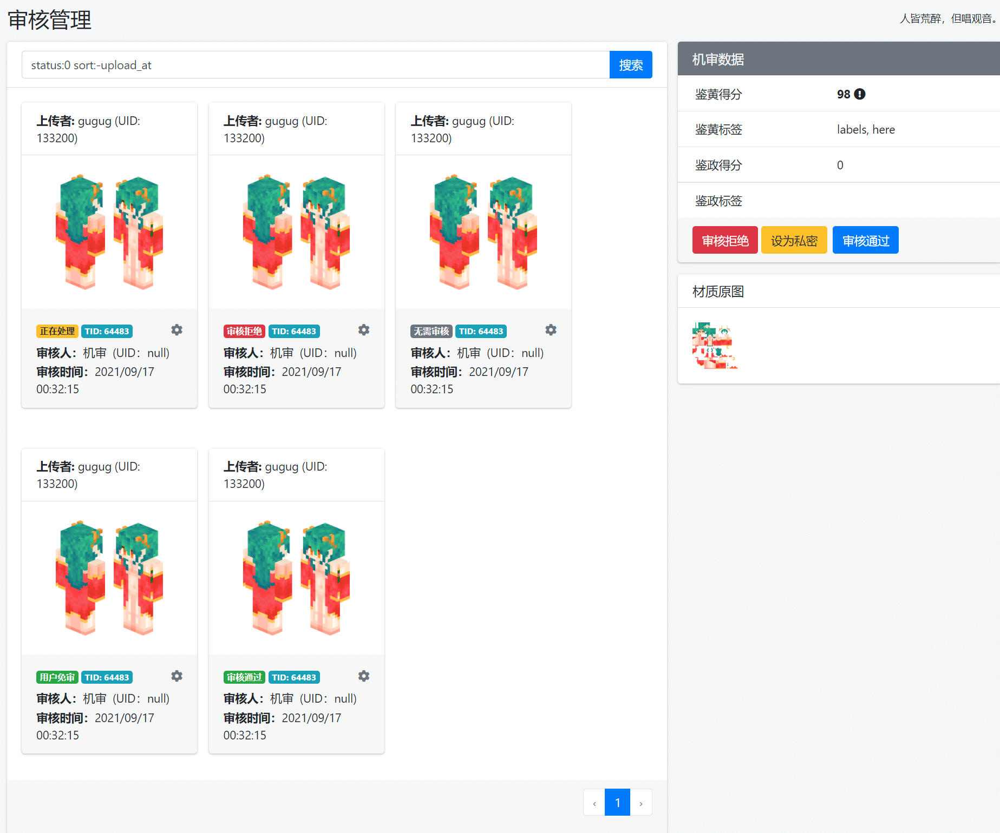
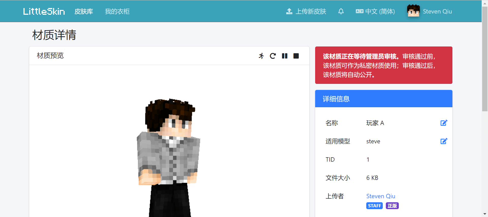

# 材质审核需求文档

材质审核分为两个部分：机器审核、人工审核。

## 插件功能

- 机器审核
- 人工审核
- 指定用户上传的材质免审

## 需要审核的内容的范围

长和宽均不小于 50px 的所有公开材质。

### 无需审核的情况

- 私密材质
- 指定用户上传的材质
- 长或宽小于 50px 的材质

## 审核的时机

- 用户上传公开材质时
- 私有材质转为公开材质时

> 请注意不要重复审核：
>
> - TID 相同的材质（公开材质转私密再转公开）；
> - Hash 相同的材质（已被审核设为私密的材质）。
> 
> 这些材质可直接根据数据表中记录的审核状态返回对应结果。

## 插件配置

需配置腾讯云 APPID、存储桶名称（BucketName）、存储桶地区（Region）、访问密钥（SecretId 和 SecretKey）、审核策略（Biztype，可留空，此时提交审核任务时请求中不应包含 `biz-type` 参数），可以考虑在 .env 文件中增加配置项。

> 虽然可以在通过 API 创建机审任务时指定 `detect-url` 参数来让数据万象直接抓取站内材质审核（而不仅限于 COS 内的图片），但调用 API 时请求的 Host 仍由 BucketName 及 Region 与其它值拼接而成，故插件仍需配置这两项。

## 机器审核

除免审的材质外，所有材质都需经过机器审核。机器审核使用腾讯云数据万象的图片内容审核功能实现。数据万象会根据图片内容，给出各个检测项目相对应的分数：

- 所有检测项目的分数属于 [0, 60] 区间内的确定正常的材质直接通过；
- 任一检测项目的分数属于 (60, 100] 区间内的疑似违规的材质转入人工审核：
  - 审核通过前可作为私密材质查看和使用（但仅先扣除公开材质消耗的积分）；

机审完成后，应记录数据万象返回的分数。转入人工审核或拒绝上传时，应给予用户适当的提示（比如弹 modal）。

### 时间相关注意事项

从发起审核到得到机审结果需要一段时间（几秒），需做好适配，以免前端超时未响应报错。

## 人工审核

机器审核疑似违规的材质转入人工审核。

转入人工审核的材质，在审核通过前尽可作为私密材质使用（但此时仅扣除公开材质的积分）：

- 审核通过后即可转为公开材质，在皮肤库中展示；
- 设为私密时：
  - 若用户积分足够支付余下的积分，则扣除积分，作为私密材质保留在用户的衣柜中；
  - 若用户积分不足支付余下的积分，则直接删除材质并返还积分。
- 审核拒绝时，直接删除材质并返还积分。

不论人工审核通过与否，审核完成后均应保留审核记录，并向用户发送站内通知。

## UI 设计

### 审核管理

类似“举报管理”页面:

（审查元素改的截图，将就看一下吧）

右上角“机审评分”部分中，分数属于 (60, 100] 区间内的项目的分数加粗显示，并在分数后增加 warning 标识。

### 皮肤库

待人工审核的材质，在皮肤库中应给予用户适当的提示（右侧上方加一个 alert）。

## 相关文档

- COS 对象存储：https://cloud.tencent.com/document/product/436
  - 生成请求签名：https://cloud.tencent.com/document/product/436/7778

- CI 数据万象：https://cloud.tencent.com/document/product/460
  - 图片审核 API：https://cloud.tencent.com/document/product/460/37318

